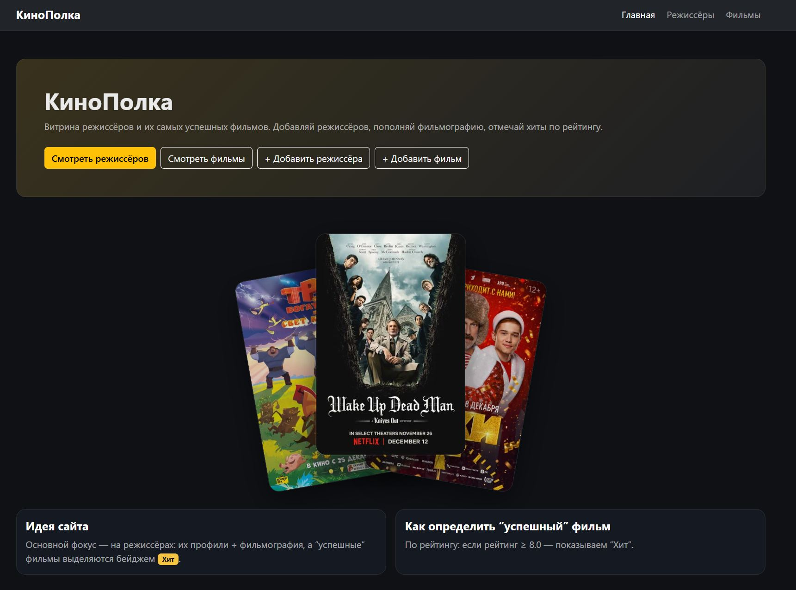
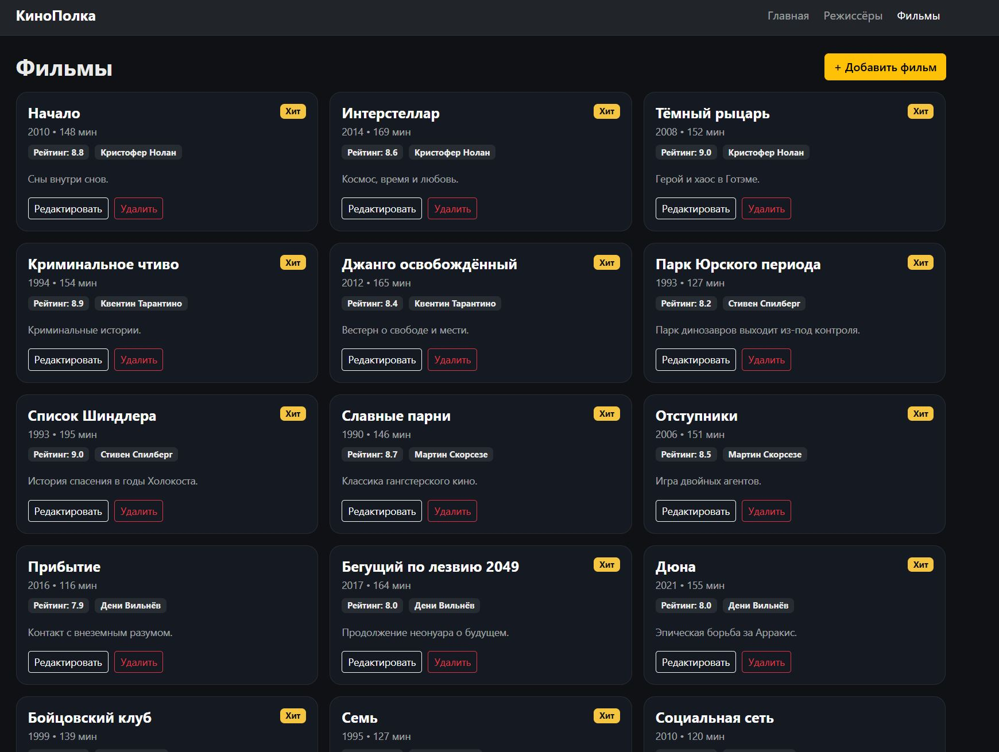
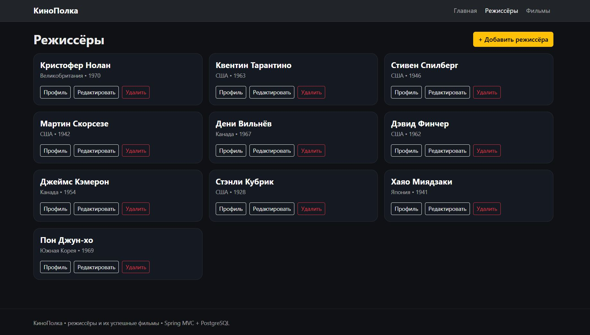
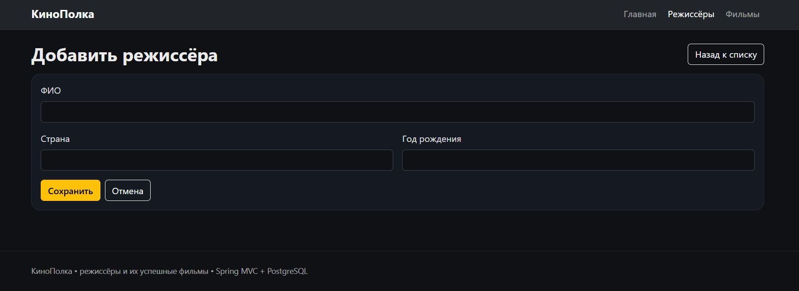
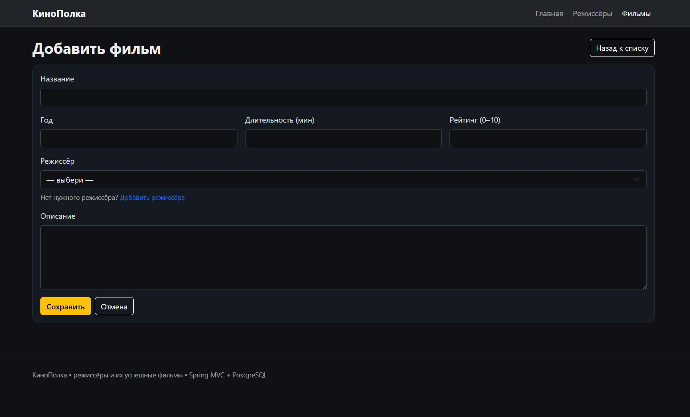
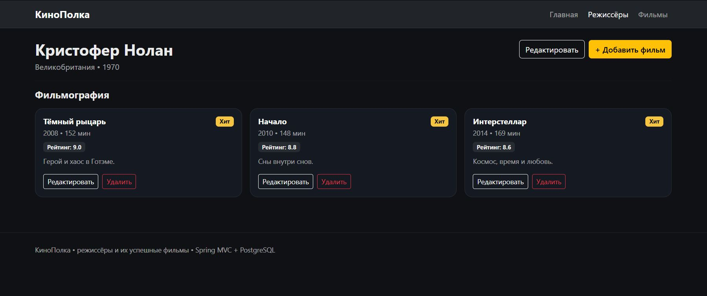

# КиноПолка 🎬
Учебное Spring-приложение для работы с режиссёрами и их успешными фильмами.

## О проекте
**КиноПолка** — небольшой веб-сайт, где можно:
- добавлять режиссёров;
- добавлять фильмы и привязывать их к режиссёрам;
- редактировать и удалять данные;
- открывать **профиль режиссёра** с фильмографией (сортировка по рейтингу);
- отмечать «успешные» фильмы бейджем **Хит** (если рейтинг ≥ 8.0).

Проект сделан в рамках практической работы по Spring с типовой архитектурой:  
**данные → логика → представление**.

---

## Функциональность (CRUD)

### Режиссёры
- список режиссёров
- добавление / редактирование / удаление
- профиль режиссёра с фильмографией

### Фильмы
- список фильмов
- добавление / редактирование / удаление
- привязка фильма к режиссёру
- бейдж **Хит** для рейтинга ≥ 8.0

---

## Архитектура (3 слоя)

### 1) Слой данных
- `model/` — сущности `Director`, `Film` (JPA/Hibernate)
- `repository/` — `DirectorRepository`, `FilmRepository` (Spring Data JPA)

### 2) Бизнес-слой
- `service/` — `DirectorService`, `FilmService` (Spring Beans)

### 3) Слой представления
- `controller/` — Spring MVC контроллеры
- `resources/templates/` — Thymeleaf-шаблоны
- `resources/static/` — стили/картинки (тёмная тема, постеры на главной)

---

## Соответствие требованиям практической работы

**Задание 1. Модель и SQL**  
Выбрана предметная область «режиссёры и фильмы». Реализованы две сущности (`Director` и `Film`) с набором свойств и связью между ними. База данных PostgreSQL используется как хранилище данных, а наполнение выполняется через интерфейс сайта (добавление режиссёров и фильмов через формы).

**Задание 2. Слой данных (Java Beans + Hibernate)**  
Сущности оформлены как Java Beans и подготовлены для работы с Hibernate/JPA: используются аннотации `@Entity`, `@Table`, и связь `@ManyToOne` между фильмом и режиссёром.

**Задание 3. Бизнес-слой (Spring Beans)**  
Реализованы сервисы `DirectorService` и `FilmService`, которые содержат логику работы с данными и операции создания/редактирования/удаления.

**Задание 4. Слой представления (Spring MVC)**  
Реализованы контроллеры Spring MVC и страницы на Thymeleaf: списки, формы добавления/редактирования, профиль режиссёра с фильмографией.

**Задание 5. Интеграция и работоспособность**  
Приложение запускается и работает как единая система: подключение к PostgreSQL, добавление/редактирование/удаление данных через сайт, отображение результатов в интерфейсе.

---

## Технологии
- Java 17
- Spring Boot + Spring MVC
- Spring Data JPA (Hibernate)
- Thymeleaf
- PostgreSQL
- Maven

---

## Запуск проекта

### 1) Подготовь базу данных
В pgAdmin создай базу:
- `kinopolka`

### 2) Настрой подключение
Создай файл:  
`src/main/resources/application.properties`

Пример (пароль поставь свой):

```properties
spring.datasource.url=jdbc:postgresql://localhost:5432/kinopolka
spring.datasource.username=postgres
spring.datasource.password=YOUR_PASSWORD

spring.jpa.hibernate.ddl-auto=update
spring.jpa.show-sql=true
spring.thymeleaf.cache=false

---

## Интерфейс приложения

**Главная страница**


**Фильмы**


**Режиссёры**


**Добавление режиссёра**


**Добавление фильма**


**Фильмография (профиль режиссёра)**

